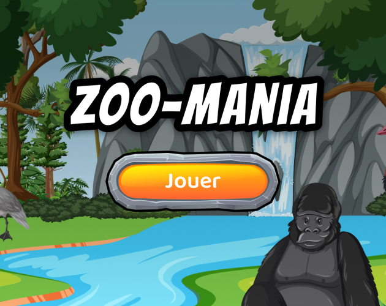

# Zoo-Mania

> Test your French vocabulary with this Animal matching game

Play the game on [Itch.io](https://a-elmahmi.itch.io/zoo-mania)

## About
A language learning game built for [TU Dublin Game Jam](https://itch.io/jam/tudublin-game-jam-2023) 

The browser game was built using the [p5.js](https://p5js.org/) library

- The player must drag the sign to the correct animal
- There are 5 levels (from easiest to hardest):
    - Farm Animals
    - Pets
    - Desert
    - Ocean
    - Jungle
- The player's score is based on how fast they can complete the game

## Screenshots

    

## Setup Instructions
1. Install NPM Packages: `npm install`
2. Run Live Server: `npm run server`
3. Go to `localhost:8080` in your browser

## How to Play
- Drag the sign to the correct animal
- The sign will snap to the animal and the player will be awarded points (more time)
- If it's the wrong name, the player will lose points
- Once all the signs are correctly matched, the user can move on to the next level
